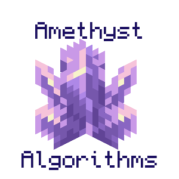

# Amethyst Algorithms: Minecraft Intro to CS Course

my desire to teach and love of minecraft all rolled into one

in sha' Allah 2025 I get to teach at a university

## summary

This course is meant to get you up to speed with many different important computer science topics using the game Minecraft as a substrate.

You'll learn basic Java syntax, how to set up an editor, how to run Java code, and slowly get more advanced until you're creating new items, new mobs, new world-generation, and more advanced concepts like custom GUIs, abstraction, interfaces, profiling, runtime complexity, 3d model editing, and more!

## topics

### easy

- debugging
- ide setup
- basic syntax
- object oriented programming (and why it can be evil OR useful)

### medium

- data types
- interfaces
- abstraction
- texture mapping
- rendering
- custom GUI

### hard

- a* pathfinding
- profiling
- runtime complexity
- optimization
- 3d models

## inspiration
- [Modding By Kaupenjoe: Minecraft Modding 1.20.X for Forge](https://www.udemy.com/course/minecraft-modding-120x-for-forge)
- over 20,000 hours into this glorious game
